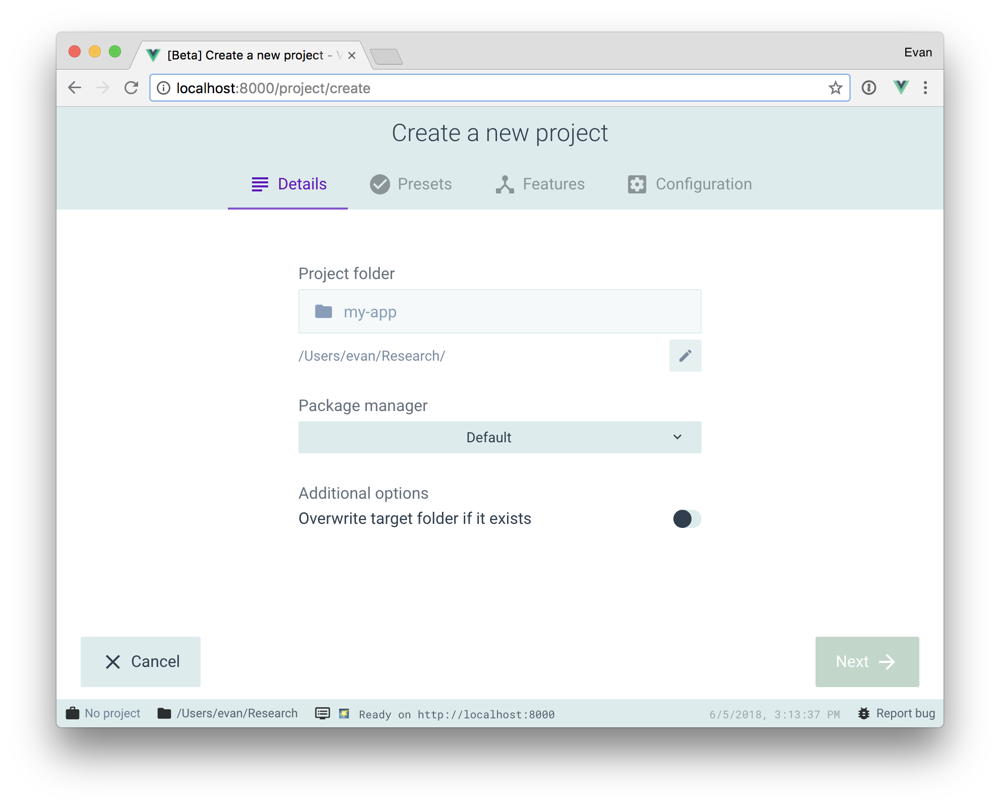

# Getting Started

## Creating a Project

### Vue create

เราสามารถสร้าง new project ได้อย่างง่ายด้วยคำสั่ง

```bash
vue create hello-world
```

### Using the GUI

สำหรับใครที่ไม่ชอบการใช้งานผ่าน command line ยังสามารถสร้างและจัดการโปรเจ็กต์โดยใช้อินเทอร์เฟซแบบกราฟิกด้วย vue ui คำสั่ง

```bash
vue ui
```

ก็จะได้หน้า GUI สวยๆแบบนี้


*img: https://cli.vuejs.org/guide/creating-a-project.html#vue-create*

[REF Creating a new Project](https://cli.vuejs.org/guide/creating-a-project.html#vue-create)


::: details แนะนำการเลือก Creating a new Project สำหรับลองเล่นเบื้องต้น
 ```bash
 vue create hello-world 
 ```

 ? Please pick a preset: **Manually select features**

 ? Check the features needed for your project: Choose **Vue version, Babel, Router, Vuex, Linter**

 ? Choose a version of Vue.js that you want to start the project with **2.x**

 ? Use history mode for router? (Requires proper server setup for index fallback in production) **Yes**

 ? Pick a linter / formatter config: **Prettier**

 ? Pick additional lint features: **Lint on save**

 ? Where do you prefer placing config for Babel, ESLint, etc.? In dedicated config files **No**

>ที่ให้เลือก 'Manually' เพราะต้องการให้เพิ่ม Router, Vuex ด้วย
:::
